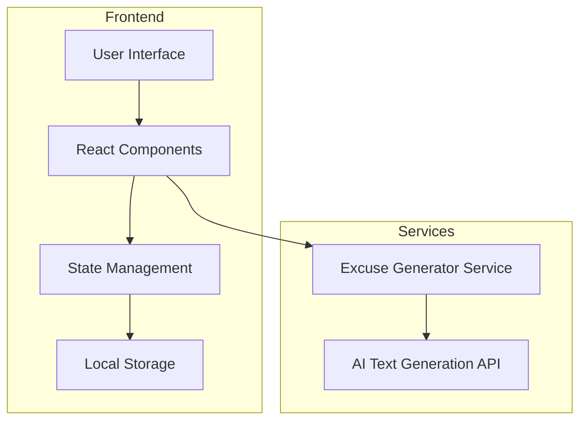
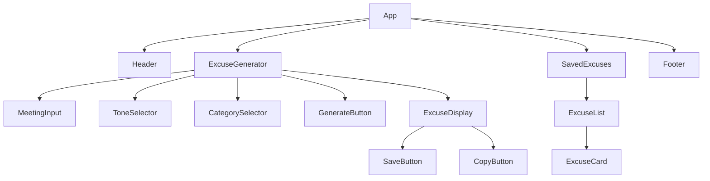
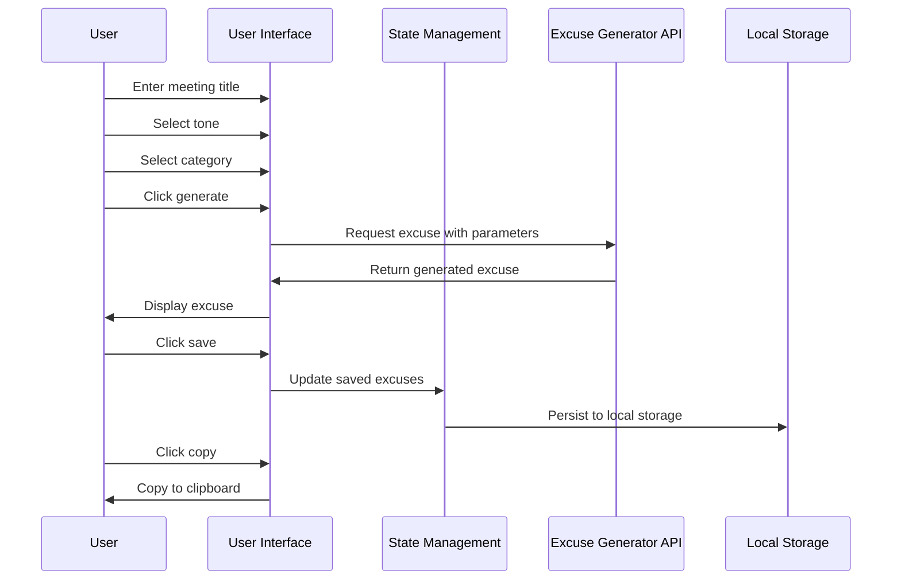

# Excuse Calendar - Detailed Implementation Plan

## 1. Project Overview

The "Excuse Calendar" is a React web application that generates believable excuses for upcoming events. Users can input a meeting title and receive AI-generated excuses with customizable tones. The app will feature a playful, colorful design with fun animations and illustrations.

### Core Features:
- Input field for meeting title
- Customizable tone selector (serious to funny)
- Generate excuse button
- Display of generated excuses
- Save favorite excuses
- Categorize excuses (work, social, family)
- Copy excuse to clipboard

## 2. Technical Architecture



### Technology Stack:
- **Frontend**: React.js, React Router, CSS-in-JS (styled-components)
- **State Management**: React Context API or Redux
- **UI Components**: Custom components with animation libraries (Framer Motion)
- **Storage**: Local Storage for saved excuses
- **API Integration**: OpenAI API or similar for generating excuses

## 3. Component Structure



## 4. Data Flow



## 5. User Interface Design

The UI will be playful and colorful with fun animations and illustrations:

1. **Color Scheme**: Vibrant colors with complementary palette
2. **Typography**: Playful, readable fonts
3. **Animations**: 
   - Subtle animations for state transitions
   - Fun loading animations when generating excuses
   - Confetti effect when saving a favorite excuse
4. **Illustrations**: Custom illustrations for different excuse categories and empty states

## 6. Implementation Plan

### Phase 1: Project Setup and Basic Structure
1. Create React application using Create React App or Vite
2. Set up project structure and dependencies
3. Implement basic routing
4. Create component skeletons
5. Set up state management

### Phase 2: Core Functionality
1. Implement meeting title input
2. Create tone selector component
3. Develop category selector
4. Build excuse generation service
5. Implement excuse display component

### Phase 3: Additional Features
1. Develop save functionality with local storage
2. Implement copy to clipboard feature
3. Create saved excuses view with filtering by category
4. Add delete and edit functionality for saved excuses

### Phase 4: UI/UX Enhancement
1. Implement responsive design
2. Add animations and transitions
3. Create and integrate illustrations
4. Implement light/dark mode (optional)
5. Add loading states and error handling

### Phase 5: Testing and Refinement
1. Perform unit testing
2. Conduct user testing
3. Fix bugs and refine UI
4. Optimize performance

## 7. AI Integration Options

For generating excuses, we have several options:

1. **OpenAI API**: Use GPT models to generate creative excuses based on meeting title, tone, and category
2. **Hugging Face**: Utilize open-source models for text generation
3. **Custom Solution**: Create a database of excuse templates that can be customized based on inputs
4. **Hybrid Approach**: Use templates for structure but AI for customization

## 8. Local Storage Structure

```json
{
  "savedExcuses": [
    {
      "id": "unique-id-1",
      "meetingTitle": "Weekly Team Meeting",
      "excuse": "I've been called in for an emergency consultation with the IT department...",
      "category": "work",
      "tone": "serious",
      "timestamp": "2025-04-07T10:30:00Z"
    },
    {
      "id": "unique-id-2",
      "meetingTitle": "Family Dinner",
      "excuse": "My pet iguana is having an existential crisis...",
      "category": "family",
      "tone": "funny",
      "timestamp": "2025-04-08T18:00:00Z"
    }
  ],
  "settings": {
    "defaultCategory": "work",
    "defaultTone": "balanced"
  }
}
```

## 9. Potential Challenges and Solutions

1. **AI Integration Complexity**:
   - Solution: Start with a simpler template-based approach and integrate AI later

2. **Performance with Many Saved Excuses**:
   - Solution: Implement pagination and efficient filtering

3. **Mobile Responsiveness**:
   - Solution: Design mobile-first and test thoroughly on different devices

4. **User Experience for First-time Users**:
   - Solution: Add tooltips and a simple onboarding flow

## 10. Future Enhancement Possibilities

1. User accounts for syncing across devices
2. Calendar integration to pull in actual meetings
3. Sharing excuses via social media or messaging
4. Analytics on most used excuse types
5. Voice input for meeting titles
6. Export excuses to calendar as "conflicts"